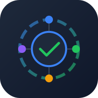

# OpenCode Task Hub

<p align="center">
  
</p>

<p align="center">
  <a href="https://www.npmjs.com/package/opencode-task-hub">
    
  </a>
  <a href="https://github.com/lztry/opencode-task-hub/stargazers">
    
  </a>
  <a href="https://github.com/lztry/opencode-task-hub/network/members">
    
  </a>
  
  
  <a href="https://opensource.org/licenses/MIT">
    
  </a>
</p>

> 🚀 一个管理多个 OpenCode AI 编程助手会话的实时任务中心。集中监控项目进度、任务分配和会话活动。

[English](README.md) | 简体中文

## ✨ 特性

- ⚡ **实时监控** - WebSocket 驱动的多会话活动更新
- 🖥️ **多会话管理** - 跨项目追踪所有 OpenCode 会话
- 📋 **任务管理** - 从仪表板创建、分配、完成任务
- 🔔 **活动追踪** - 实时显示每个会话的当前操作
- 🌐 **跨平台** - 支持 macOS、Linux、Windows
- 💾 **本地优先** - 数据存储在本地，无需云端
- 🔌 **插件集成** - OpenCode 会话自动注册
- 📝 **指令捕获** - 自动识别并记录用户输入的任务指令到任务列表
- 🎨 **简洁美观** - 深色主题现代化 UI

## 🎬 演示


**仪表板预览:**


## 📦 安装

### npm 安装（推荐）

```bash
npm install -g opencode-task-hub
opencode-task-hub
```

### Docker 运行

```bash
docker run -d -p 3030:3030 \
  -v $(pwd)/data.json:/app/data.json \
  lztry/opencode-task-hub
```

### 手动安装

```bash
git clone https://github.com/lztry/opencode-task-hub.git
cd opencode-task-hub
npm install

# 安装插件 (macOS/Linux)
./install.sh

# 安装插件 (Windows)
install.bat
```

## 🚀 快速开始

```bash
# 1. 启动服务器
npm start
# 或开发模式（自动重载）
npm run dev

# 2. 打开仪表板
open http://localhost:3030

# 3. 开始使用 OpenCode
# 每个 OpenCode 会话都会自动注册到任务中心！
```

## 🏗️ 架构

```
┌─────────────────┐     ┌──────────────────┐     ┌─────────────────┐
│  OpenCode #1    │────▶│                  │◀────│  OpenCode #2    │
│  (Project A)    │     │   Task Hub       │     │  (Project B)    │
└─────────────────┘     │   Server         │     └─────────────────┘
                        │   + WebSocket    │
┌─────────────────┐     │                  │     ┌─────────────────┐
│  Dashboard      │◀────│   (Port 3030)    │────▶│  OpenCode #N    │
│  (Browser)       │     │                  │     │  (Project N)    │
└─────────────────┘     └──────────────────┘     └─────────────────┘
```

## 📡 API 接口

### REST API

| 方法   | 端点                           | 描述             |
|--------|-------------------------------|-----------------|
| GET    | `/api/sessions`               | 获取所有会话      |
| POST   | `/api/sessions/register`      | 注册新会话       |
| POST   | `/api/sessions/:id/heartbeat`  | 发送心跳         |
| POST   | `/api/sessions/:id/log`        | 记录活动日志      |
| DELETE | `/api/sessions/:id`            | 删除会话         |
| GET    | `/api/tasks`                  | 获取所有任务      |
| POST   | `/api/tasks`                  | 创建任务         |
| PUT    | `/api/tasks/:id`              | 更新任务         |
| DELETE | `/api/tasks/:id`              | 删除任务         |
| POST   | `/api/tasks/:id/assign`       | 分配任务         |

### WebSocket 事件

| 事件              | 方向        | 描述             |
|-----------------|-----------|-----------------|
| `connected`     | 服务端→客户端 | 连接时发送初始状态 |
| `session:created` | 服务端→客户端 | 新会话注册       |
| `session:updated` | 服务端→客户端 | 会话心跳/更新     |
| `session:removed` | 服务端→客户端 | 会话断开         |
| `activity`       | 服务端→客户端 | 会话活动日志      |
| `task:created`  | 服务端→客户端 | 新任务创建       |
| `task:updated`  | 服务端→客户端 | 任务状态更新      |
| `task:deleted`  | 服务端→客户端 | 任务删除         |

## ⚙️ 配置

### 修改端口

```javascript
// server.js
const PORT = 3000;
```

### 环境变量

```bash
PORT=3030           # 服务器端口
DATA_FILE=./data.json  # 数据文件路径
```

### 数据存储

数据默认保存在 `data.json`。可自定义路径：

```bash
DATA_FILE=/path/to/data.json npm start
```

## 🔌 插件工具

任务Reporter插件提供以下工具：

- `registerTask` - 手动注册当前会话
- `updateTaskActivity` - 记录自定义活动描述

## 🧪 测试

```bash
# 运行所有测试
npm test

# 监听模式
npm run test:watch

# 覆盖率报告
npm run test:coverage
```

## 🛠️ 开发

```bash
# 克隆仓库
git clone https://github.com/lztry/opencode-task-hub.git
cd opencode-task-hub

# 安装依赖
npm install

# 启动开发服务器
npm run dev
```

## 🤝 贡献

欢迎提交 Pull Request！请查看 [CONTRIBUTING.md](CONTRIBUTING.md) 了解详情。

## 📄 更新日志

查看 [CHANGELOG.md](CHANGELOG.md) 了解版本历史。

## 📜 许可证

MIT License - 详见 [LICENSE](LICENSE)

## 🔗 相关项目

- [OpenCode](https://opencode.ai) - AI 编程助手
- [Agentlytics](https://github.com/f/agentlytics) - AI 编程分析工具
- [OpenCastle](https://github.com/etylsarin/opencastle) - 多智能体协作框架

## ❤️ 支持

如果你觉得这个项目有用，请给我一个 ⭐！

[](https://star-history.com/#lztry/opencode-task-hub&Timeline)
